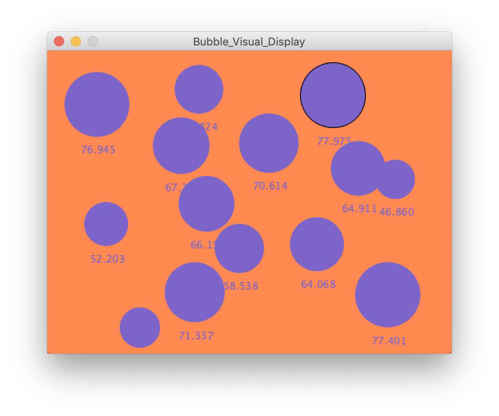
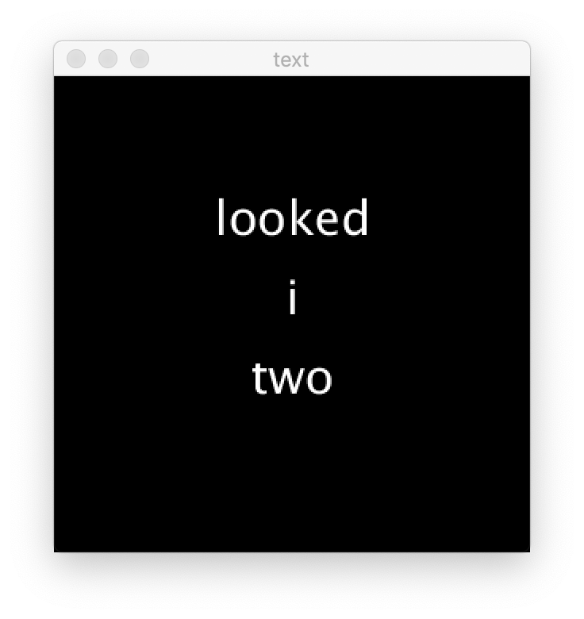

**Data Visualization**

For this assignment, we're asked to create datat visualization or a generative poem/ text. In class, we were introduced to data files such as csv and jston, and we also looked into spliting, joining, and using tables as ways to import data into processing and then creating visualization of them. At first glance, the project is really interesting. There are countless exmamples of ways data are being visualized, and some of them are pretty mind blowning. However, this is so far one the most confusing and complicated processing assignment for me, partly because of my infamiliarity with data and the various ways of organizing and importing files. After many trials, I ended creating three projects, each increasing in difficulty as I slowly understand more of the code and the language. 

The first one I created is a simple visualization of a text file. Here, numerical numbers are included in the text, and the code creates circles that represents these numbers. Despite the code being simple, the seemingly simple process of creating the data file and making it into files acceptable by processing are surprisingly tasks that too me a long time to navigate. In the end, I played around with the color and composition a bit. See the image below for the end product!

The second project I created is modified based on an example data code on processing.org. The code was difficult to understand at first, as it incoporates various elements. In the end, I played around with it, adding text, different files, color changes etc. This is also a step from using the numerical numbers from a text file above to using tables in a csv file. 
Check out this video and some picture of it!

This last project was the one that I wanted to make the most- a text generator. I was stuck on it for quite a bit, as I couldn't use the way I retrieve information from the floats/ numbers and directly convert them into strings and texts. There are some additional steps that needed to be taken, in addition to the random word order that comes up. In the end, with youtube tutorials and more researching, I was able to figure out what I was missing and create this generator. I see this one as a start, and I'm definitely interested in making it neater so that I could potentially go to it for inspirations when I'm wriitng!

