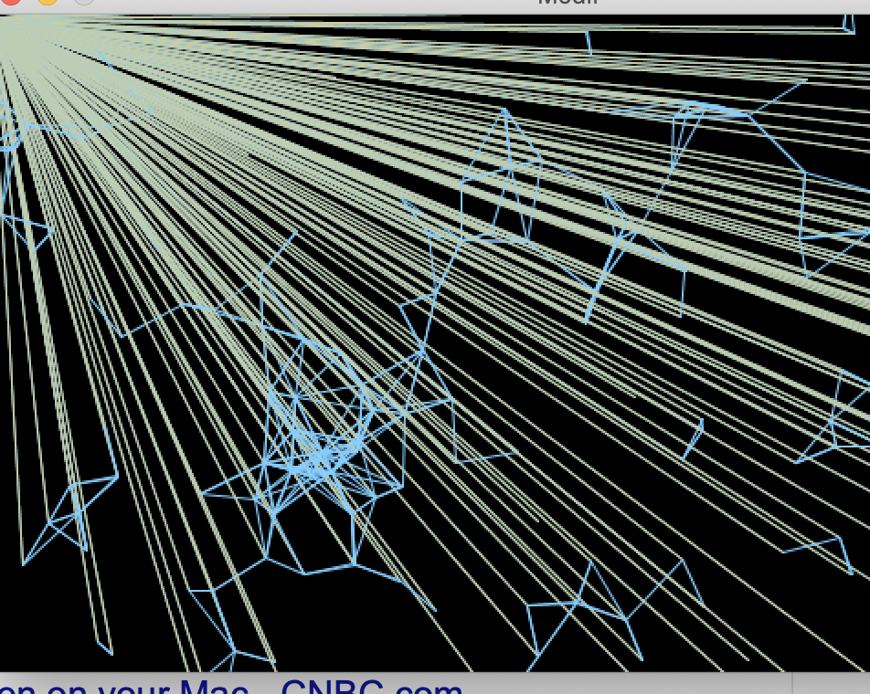

**Experimentations**

For this week's assignment, we're asked to go through the codes from Aaron, our guest lecturer last week, and experiment with the codes. For me, the code introduced some new concepts, and it's exciting being able to explore around and make adjustments. For instance, for my result, the lines that shine down from the top left corner is a result of an accidental change, and yet I find it interesting and thus kept it. Click here for to see my end product!

