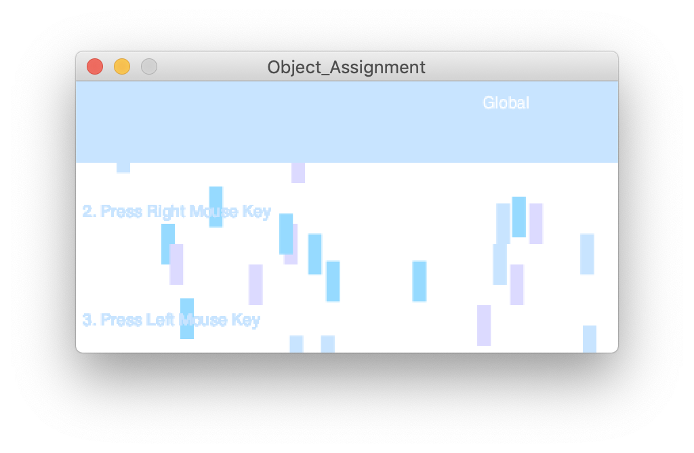
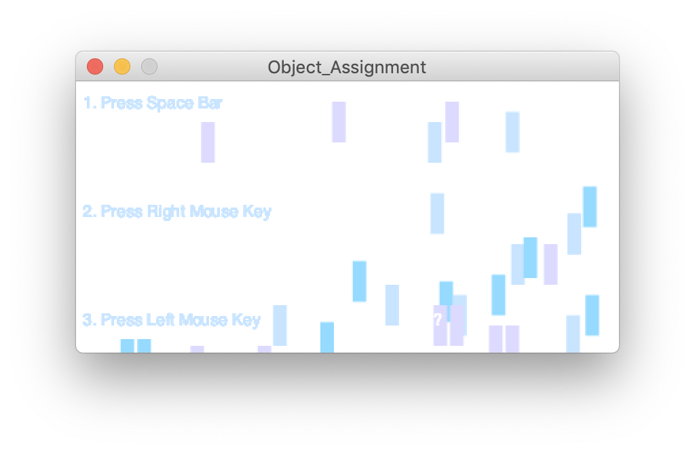

**Object Oriented Programming**

Progressing from the idea of functions we learned last week, this week we were introduced to the idea of object oriented programming. Essentially, there are classes and arrays that allow us to organize codes and improve efficiency by not having to repeatedly type similar codes. For this assignment, we were asked to create a piece of art or a game that uses object oriented programming. For my project, I created an interactive art piece that displays different messages when the viewer follows the instructions.

Click here to watch a video of the project! 

For the piece, there are rain droplets falling down in various speed, mimicking different kinds of rain and storms. On the left, there are three directions put in order by numbers. These textual instructions ask the viewer to click on their left/ right mouse or a key on the keyboard. This will turn on the mousePress element in the code, allowing rectangular boxes to show. These boxes represent the sea level caused by rain and climate change, which are shown in three different levels/ heights. As the viewer progress throughout the piece, they will read a message- "Global Warming ???"- while the instructional texts will disapper. This is created in hope of creating a visual, interactive way of provoking different thoughts on our environment. 

The most difficult part of the code is trying to understand and utilize class. For me, it took a couple tutorials, rewatches, and  class notes to create my class. I find that often times it is easier to modify existing codes first before trying to create a completely new code. Through the process of modifying existing codes, I begin to understand more of the layout fo the codes, which then helps me put this knowledge into application later on. For this assignment, I also tried adding texts and mousepress, two features in Processing that I haven't tried before. It is exciting to see the codes turning from creating 2D objects to more interactive, responsive images, and here are some pictures of my project!

