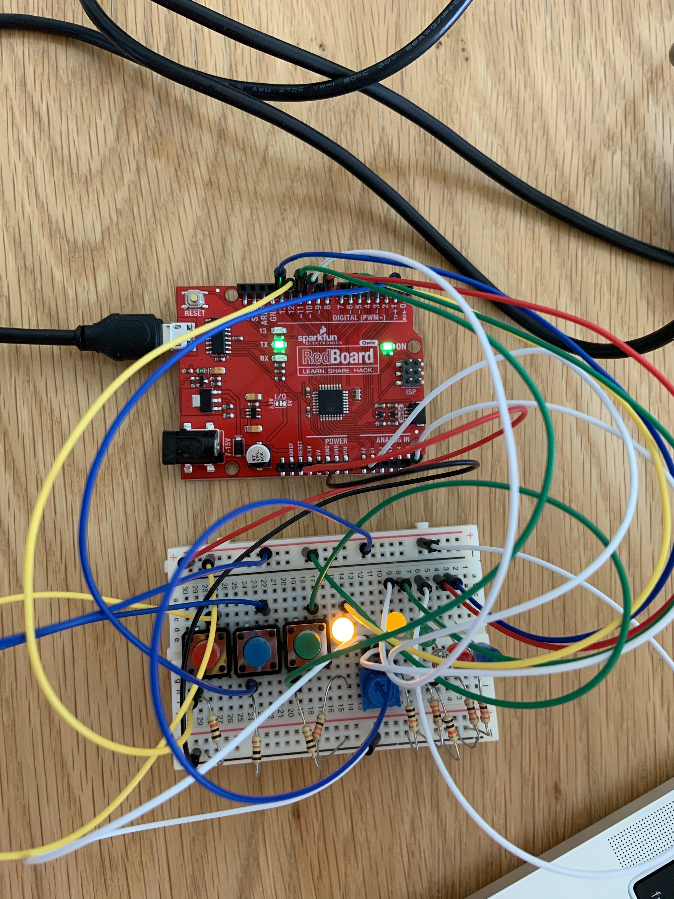
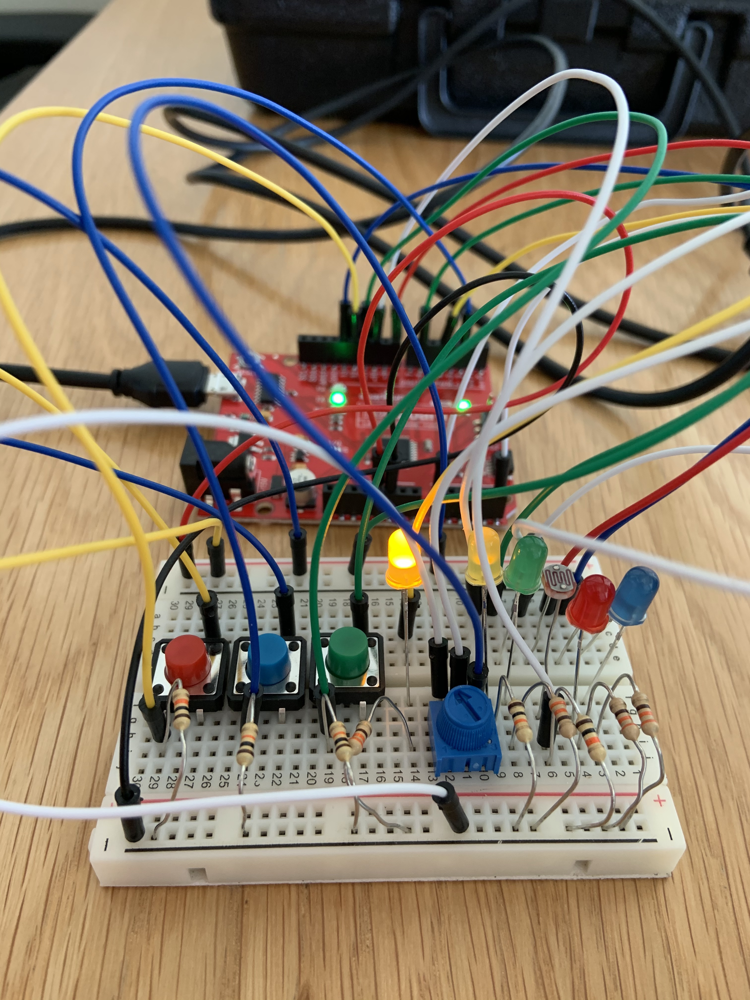
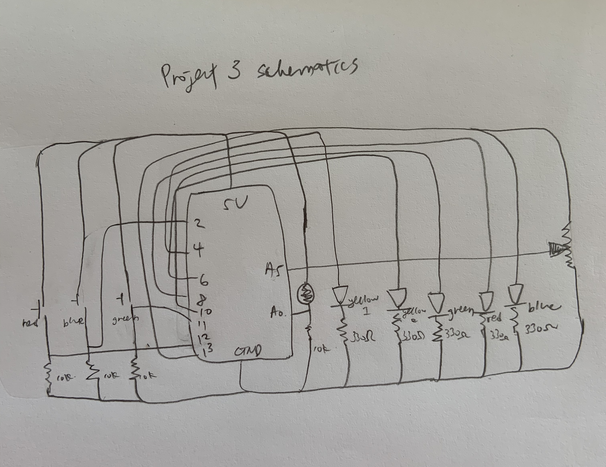

**Digital & Analog Combined**

For this week’s circuit we’re asked to create a project that involves both digital and analog inputs and outputs. In simple terms, this means that we’ll have to create something that is switch like- follows the command of on or off- and something that’s in between- gradually turns up or down depending on intensity of input and reflected in the output. 

As Go Green Week is taking place this week, I’m inspired by the works and projects on campus that shed light onto the sustainable, environmental awareness issues around us. Therefore, I would like to create a project that mimics that of a home light control system. When more lights are on, the light resistor will detect more light, and therefore the signifying lightbulb will light up brighter. However, if the lights are dimmer, the signifying light bulb will also decrease in its brightness. As a result, this light bulb will be able to serve as an indicator how many lights are on in a house, allowing one to be aware of lights that are not needed and can be turned off, or ways to decrease the use of lights and energies in the spaces. 

The light sensor is surrounded by three light bulbs controlled by switches, and additionally there is another light bulb controlled by the potentiometer. This mimics the different kinds of lights that may exist in a space- lights that are quick to be turned on or off with specific brightness, like switched on lights, and also light that are less consistent and have a range of brightness, such as candles. 

As I was creating the project, I realized that I have now become quick at assembling the circuit board, being able to think a lot faster and clearer than when classes first started. However, I still find it difficult for myself to be fluent in the coding language. Even though things are starting to make more sense and I’ve become more accustomed to the logic of coding after reading and watching tutorials online, I still find it really time consuming and difficult at times. For now, I’m keeping faith in the idea that eventually I’ll be able to understand it more and become confident at playing with codes and adding variations to it. 

Included below are pictures of the schematics of this project. It’s exciting seeing that the original board is running low on space- I never thought it would be that fast before I’d be moving on to a larger board with even more possibilities!

