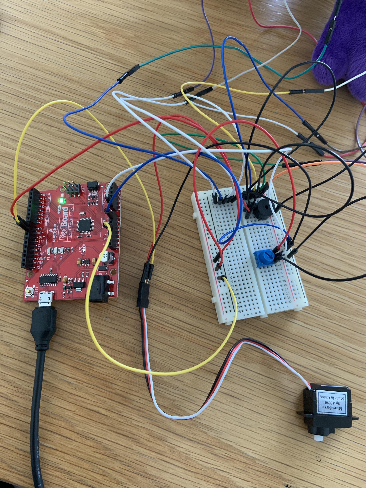

**DIY Musical Instrument**

After weeks of silence, we’ve officially entered the stage of sound making using arduino and its buzzers. For this week’s assignment, we were asked to create a musical instrument with a servo motor. With my fondness towards music, this project was both exciting and intimidating- I was excited by the prospect of making music with tools I’m not familiar with, and yet I know that the music I make won’t be the highest quality or loveliest tunes I’d be able to produce with my piano or clarinet. Therefore, after considering the pros and cons, I decided to take on a fun, entertaining approach towards this project. 

For my design, I created a musical toy that would help children learn while playing. The dinosaur will be playing head, shoulders, knees and toes, a familiar children’s song for learning body part names, and there will be a connection stick. In order to keep the music playing, one would have to touch the corresponding body parts of the dinosaur to complete the circuit, thus allowing the music to play. There is also a motor servo, which rings and makes a clapping-like sound when the song begins and ends, serving like a percussion instrument. The project aims to be both interactive and fun, as active learning can be a useful tool for younger age kids to learn and remember. 

The program and circuit for this project is fairly straightforward with the help of programs from toneMelody and Knob. The music continues to play as the program goes, with rhythms and notes prewritten into the program, and the instrument will be able to play music when the circuits are connected through the stick that touches the dinosaur’s body parts, which are covered with wires that can be connected. 

Despite this fairly simple setup, there are still challenges along the way. I first started with tin foil and bronze tape as the connection points for the stick and the body part of the stuffed animal. However, as the toy is soft and the foils are harder in nature, one would need to press down hard in order to allow good connection between cables for the music to play without intermittent disconnections. Therefore, I decided to simply use the wires themselves, connecting by allowing one wire to touch another. After completing the projects, I thought of a couple aspects for future improvements and experimentations. For instance, a deficiency of the toy is that since the music will resume when connections are made, the child can touch any body part of the dinosaur to produce music. This made it impossible to check for the accuracy, as of whether or not the part one is pointing at corresponds with the body part mentioned in the song. To fix this, it would be better to have individual buzzers attached to each body part, and therefore the music a part plays will be specific only to that part. However, this would result in a huge circuit system, and wouldn’t be able to control the rhythm or beat of the song as the kid can pause for a long time before continuing. On the other hand, the current system will teach the kid to follow the beat and point accordingly. In this case, it is clear that designs often have setbacks and compromises one has to make, and it is interesting to see if there are other alternative solutions possible.

Attached below are some pictures of the circuit, schematic, and the toy itself. I hope you’ll be able to try it sometime. [Click here](https://youtu.be/25NTIPZlW-g) to view a video of the toy when playing!

