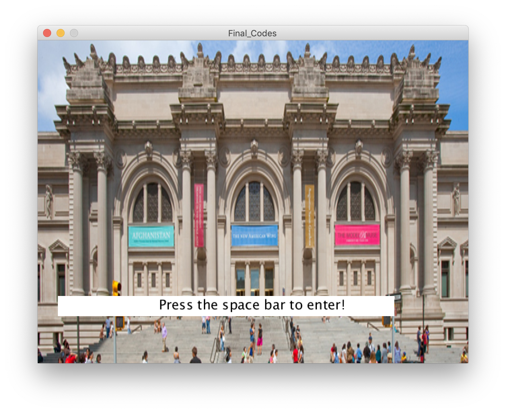

**Final Project**

For the Final Project of the class, we're asked to create a project with all the knowledge we've learned with Processing. Inspired by the recent development of art museums moving online for the audience to continue to engage with art, I decided to make an online gallery featuring the art pieces I have made this semester with Processing. For me, Intro to IM still feels like an experience too wild to be true- as someone with no previous coding experience, I can still feel the intimadation I  experienced when seeing code for the first time in class. Yet, I think what this museum manages to do is to provide another feeling for me. It's a visual representation of what I've struggled with, worked out, and learned throughout the semester, and I still find it unbelievable that these images and the museum experience are written by me. The museum serves as a reflection of the things I've learned, and serves as an encouragement for me to continue learning and challenging myself so I can achieve even more with this exciting new tool I unlocked this semester. 

For my project, it aims at providing a portfolio, museum going experience. When the program is first loaded, the front of the MET museum is show. When the audience presses the space bar, they'll be able to 'enter' the museum and into the gallery hall. On the walls of the gallery, there are five pieces of art I created or modified this semester, along with a poem generator. By pressing on the numbers indicated on the placard next to the art piece, the viewer will be able to see a close up, complete view of the selected art piece now on display on the canvas. However, the art piece one sees will not be exactly the same as the one shown in the gallery. Rather, the art piece is a variation I've created using the codes from the class assignments this semester, buiding on what I know to get more exciting results.

The code in this project is not very difficult, but does involve some detail sorting. There is also quite some experimentation involved as I play around with the existing codes and make modifications of them. The most confusing part in the process was when I press my mouse on any other canvas that doesn't have a mousepress function, an error will appear on the code. After reaching out to Michael, we worked on establishing mousepress with some conditions so that it will only work when the mouse is clicking the specific image. Even though this may seem simple and straightforward, due to my lack of coding experience it's something I've never considered before, and I'm grateful to have reached out to Michael, who explained well for me to understand why and what to do. 

Included below are some pictures of the project and [a video](https://youtu.be/iGKFMwfQLCk) of the project working. Intro to IM challenged me to think more critically- not simply as an artist but with logic and attention to details. If I were to summarize my experience in this class, it would be one that is bittersweet but rewarding, and one that not only challenges my thinking, but inspired me to keep on learning and trying while not being afraid to ask for help along the way. This was a semester full of gratitude for me, and this class is no exception of that. 

