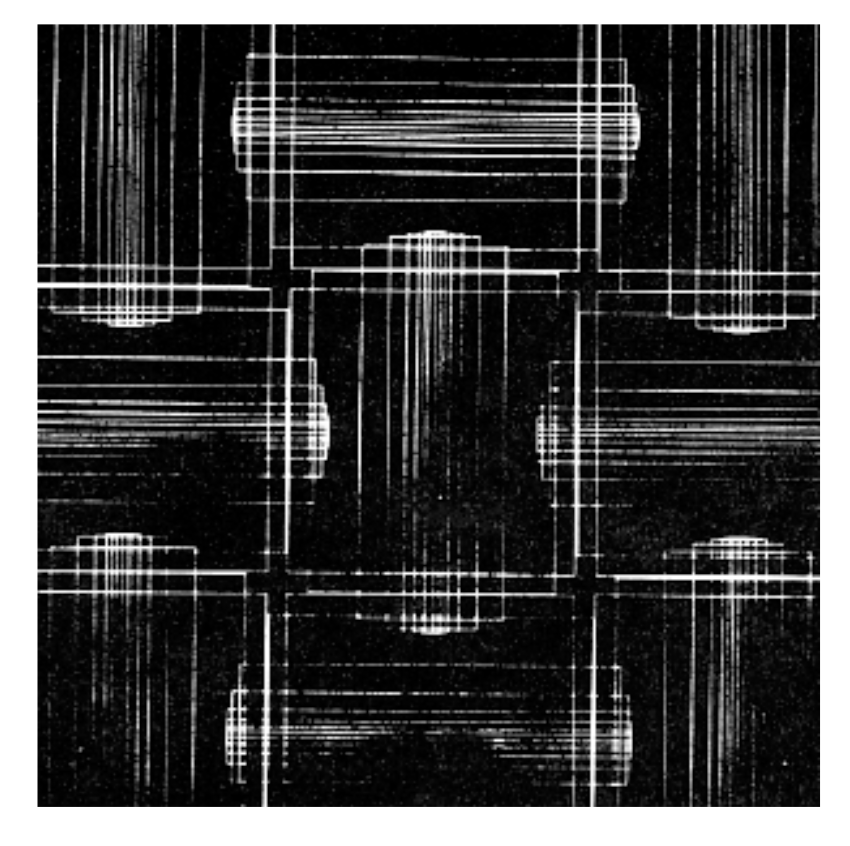
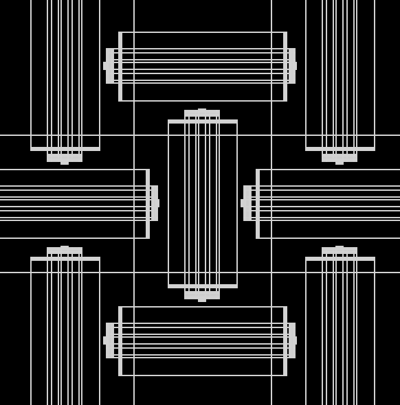
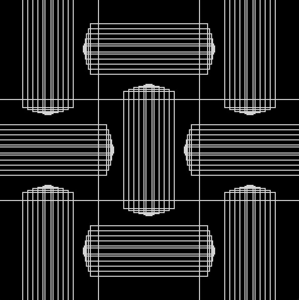

**Remaking Computer Art**

For this assignment, we're asked to recreate a piece of computer art using Processing, with a special focus on using the transformation functions in Processing, including translation, rotation, and scale, and also with the for() loop function. For my assignment, I chose a piece of art by Roger Vilder created in 1976. Presented below are images of his original piece and my remakes. In the end, I created two copies of the art, one using mainly the transformation functions and the other one with an attempt to use the for(). Since both of the ideas are rather new and counterintuitive to me, I decided to focus on one element at a time, which is why I ended creating two. In the first piece, it's mostly done with the translation functions, and in the second piece, I combined the for loops with some simple rotation and translation as I became more comfortable with building functions, translations, and the loop. There were quite some confusions in the making of these, but I found the tutorials and the website to be very helpful. Something I find difficult is that in an if(), as shown in my second code, unless set with pushMatrix and popMatrix, otherwise it seems like for a rotated shape, everytime it is applied in a for statement it changes the coordinates of the grid. Or perhaps it's because of some other reasons, but I find it difficult to calculate the numbers while drawing the horizontal rectangle shapes in the second code, and it is something I would like to continue to learn and understand as we progress. 

This is the original art.

This is the first piece.

And here's the second one. 

