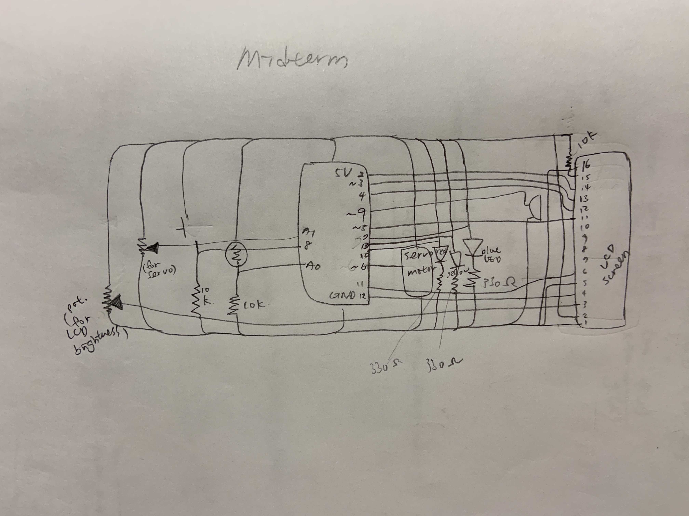

**Midterm Project**

For the midterm project, we’re asked to create a project that showcases the skills and knowledge we’ve learned from the past few weeks. I decided to create a music box, or a musical displaying toy that would combine multiple functions of the Arduino that we learned. In the end, I built a castle-like music box that plays music and reacts in response to the weather. When there is light shining upon the light resistor, the music box will play you are my sunshine with the yellow LED lighting up, and when the photo resistor is covered, it'll play rain rain go away, as if on a cloudy, rainy day, and the blue LED will light up. There is also a servo motor that turns the display of rain clouds or sun depending on which song is playin. There are two breadboards, one longer one in the front, and one in the back with the lcd board attached with "Hi sunshine <3" showing on it. Inside the fort is the arduino redboard, which is secured by the two foams that closely set it between tightly. 

In the picture below, the schematics of the project is provided, and it provides an idea of the inputs and outputs of the circuit. In the project, the red button controls the green light, which can be turned on and off when pressed. This is completed by the code that prestates the initial stages of the buttons, which allows an LED to remain turned on or off everytime the button is pressed. The LED is soldered, which allows it to be longer and is decorated on top of the wall. There are two other soldered LED, and they light up depending on the music that is playing. There is also a servo motor, which can be controlled by a potentiometer. The potentiometer will rotate the motor, which is decorated with a sun and a rain cloud to indicate the different weathers. The servo also turns automatically when the music is playing. It turns 90 degrees to display the rain when rain rain go away is playing, and turns 180 degrees to display the sun when you are my sunshine is playing. The buzzer is attached to the longer breadboard, which will play you are my sunshine when the light resistor is triggered, and when it’s dark it plays rain rain go away. An lcd screen is attached to the smaller breadboard, which displays hi sunshine <3. This is my first time working with a LCD screen, and it is encouraging to find that it is not as difficult as thought when I follow the instructions on the Arduino website to set it up. Here are some pictures of the project in the process of being built, and a close up of the lcd screen display. 

The codes for this project is not very complicated in their individual parts, and can be seen in the ino document in this folder. Simply stated, the LED can be turned on or off with the code in the beginning, as well as the motor code that allows it to be freely rotated as controlled by the potentionmeter. In the brackets, there are three ifs. If the light resistor detects light that is under 650, which occurs when the sensor is covered, it will play melody1, which is rain rain go away. This will also trigger the servo to rotate 90 degrees and light up the blue LED, as all these commands are inside the first if bracket. Then, if the resistor detects light to be between 650 and 900, it won't play any tones, which is why the music box is silent in the room under normal lighting. When the sensor detects over 900, which can be achieved with a flashlight, it will play you are my sunshine, trigger the motor to rotate 180 degrees to display the sun, and light up the yellow LED. In the meantime, the LCD screen continues to display "Hi sunshine <3" with its inpendent code. 

Even though this project uses mostly topics and elements we have covered in class before, I still find it rather difficult to execute. For instance, the part to combine the individual codes into one unified code is difficult, because the order, brackets, and sequences all have influences on the overall development and execution of the code. However, as one who has no prior experiences in coding, these sequences, rules, and things one may coin as common sense are all foreign to me, and it is only through multiple trials, confusions and others' help that I’m able to grasp some part of this. In the end, after talking with professor, I learned the importance of the brackets and the codes contained within each brackets. It is important to make sure that the bracket only includes codes that are in parts together so that other functions are still able to operate outside of them. Other difficulties include assembling codes and figuring out their orders, soldering for the first time (which was so fun!), constructing the physical display of the music box. I also learned that it is important to plan out the pins early, becuase some special pins, like A# pins and pins with ~ can be used up easily, as mentioned in class, and therefore planning out early will save time and efforts later if those pins need to be used for their specific purposes. 
Here is a picture of the longer breadboard in the end, and also a picture of the back of the project after I grouped the wires. I also included one of the sketches I drew when building the music box to show the planning and organizing of the physical composition in its progress. 

Included below are images of the project (its front and side).

[Click this link](https://youtu.be/nNhU6NgrmtU) to see the project when it is sunny.

[Click this link](https://youtu.be/0AeN56nquh0) to see the project when it is rainy.

[Click this link](https://youtu.be/tXTydJKWkEQ) to see the project's other functions.

Lastly, if interested, [click this link](https://youtu.be/Qfss7bGcJew) to see the project when it is still in the process of being build.
